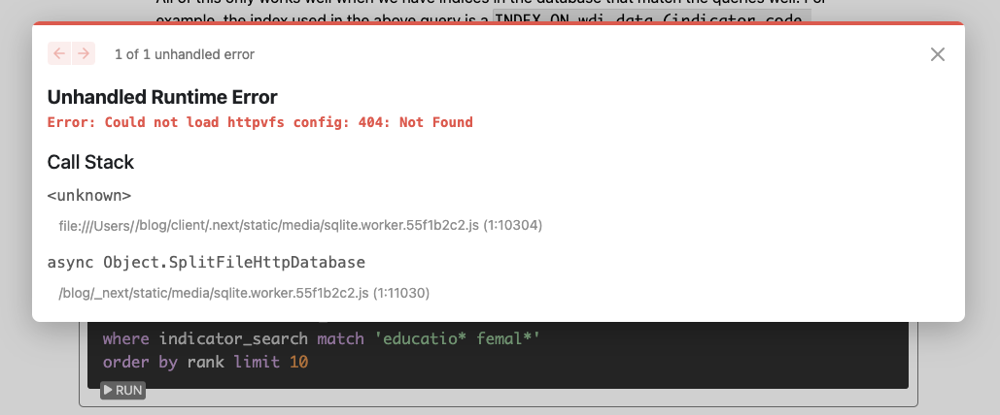

[Timelines ML](../../) 

The timeline chart is [React Recharts D3](https://recharts.org/en-US/storybook)
Defined in phiresky's [FtsDemo.tsx TypeScript](https://github.com/phiresky/blog/blob/master/client/sqlite-httpvfs/FtsDemo.tsx)

The following aims to run [Phiresky's excellent SQLite timeline sample](https://phiresky.github.io/blog/2021/hosting-sqlite-databases-on-github-pages/) locally and then on GitHub Pages.

Unresolved Error (see below): Could not load httpvfs config: 404 Not Found
[Posted as issue](https://github.com/phiresky/blog/issues/13)

<!--
	Later, update mext-blog version if it didn't automatically.
	https://github.com/tscanlin/next-blog?tab=readme-ov-file
-->

# SQLite in Browser

Try [Steps for deploying a React App to Github Pages](https://gist.github.com/vre2h/da9db3733c238c174d13670fb77c1f1a)

Fork [our fork](https://github.com/ModelEarth/blog) of Phiresky's blog sample, then clone to your local computer.

Please add to the steps below on installing the SQLite blog. [Fork to edit current page](https://github.com/ModelEarth/data-pipeline/tree/main/timelines/sqlite/phiresky/).

You could use this [Pandoc GitHub Action](https://github.com/pandoc/pandoc-action-example) to convert documents on GitHub's servers with every push, to avoid building locally.

Once the Github Page deployment works, our fork will be visible at [model.earth/blog/2021/hosting-sqlite-databases-on-github-pages](https://model.earth/blog/2021/hosting-sqlite-databases-on-github-pages/)

## SQLite blog sample install

We recommend upgrading your OS before starting if your current version is more than 2 months old.

(1) Update to the latest version of Next and React.
And download the React DevTools for a better development experience:
[https://reactjs.org/link/react-devtools](https://reactjs.org/link/react-devtools)

Clone the blog into your webroot

	git clone https://github.com/phiresky/blog blog &&
	cd blog

<!--
	git clone https://github.com/modelearth/blog blog

This was probably un-done:
In our fork, Nextjs is migrated to the new version which uses RUST.
-->

Optional: start a virtual environment in the local folder and add env/ to the .gitignore file.

	python3 -m venv env &&
	source env/bin/activate

Tried this to

	yarn up

Source: https://stackoverflow.com/questions/41914056/get-yarn-install-to-fix-errors-yarn-check-finds

These eliminiate warnings by fetching from the remote registry:

	yarn add react-katex &&
	yarn add webpack &&
	yarn add prop-types &&
	yarn add recharts

Maybe this too:

	yarn add react-katex

Maybe

	yarn react

Later got
Internal Error: next-blog@workspace:
Maybe run

	yarn add next-blog

Now you hopefully see no more resolution steps listed.

	yarn up

<!--
Tried this, did not fix:

	yarn add react-katex

	npm list
	npm install

Install React and React Devtools (Skipped this March 7, but let's try upgrading in our fork)

	npm install next@latest react@latest react-dom@latest &&
	npm install -g react-devtools
-->
---

next-blog@workspace:.: This package doesn't seem to be present in your lockfile; run "yarn install" to update the lockfile

phiresky says to run `yarn install` to install all dependencies. (Says do not run npm install typescript)

	yarn install

You may need to install pandoc if you have not done so previously. See the Pandoc Install Notes at the bottom of this page.

The blog site uses yarn pnp, so no node_modules folder is needed.
Therefore don't run `npm install` - Doing so creates a node_modules folder.
The alternative:`npm ci` is not an option because there is no package-lock.json file.
Otherwise `npm ci` is a newer alternative to `npm install` which does not change the package-lock.json file.

HOWEVER, running `npm install` will tell you this specific dependency to resolve.

Error: Cannot read properties of undefined .pnp.cjs
This relates to nextJS.

Could not resolve dependency:
npm ERR! peer react@"^15.3.2 || ^16.0.0" from react-katex@2.0.2
npm ERR! node_modules/react-katex
npm ERR!   react-katex@"^2.0.2" from the root project

### Fixes applied in our Fork of the "blog" repo

Fixed nextjs link error.  Invalid <Link> with <a> child. Please remove <a> or use <Link legacyBehavior>

	npx @next/codemod new-link --force

You might need to add [Pandoc GitHub Action](https://github.com/pandoc/pandoc-action-example) in your fork of [our fork](https://github.com/ModelEarth/blog) to convert documents on GitHub's servers with every push (or maybe just building locally is fine).

When there was no longer the error above, Internal Error: next-blog@workspace:.: This package doesn't seem to be present in your lockfile; run "yarn install" to update the lockfile. <!-- `yarn up` did not work here. -->

	yarn install

Run these commands in the blog folder (These are from the [blog folder readme](https://github.com/phiresky/blog/)):
"yarn dev" provides the hot-reloading dev server.

	yarn posts &&
	yarn dev

Success, returned:

Next.js 14.1.3
Local: http://localhost:3000 (Returns 404, so go to /blog and page link instead)

These should now work:
[localhost:3000/blog/](http://localhost:3000/blog/)
[http://localhost:3000/blog/2021/hosting-sqlite-databases-on-github-pages](http://localhost:3000/blog/2021/hosting-sqlite-databases-on-github-pages/)

## No Luck yet? - Then drop the `npm install` bomb

Still not working, run `npm install` which generates a package-lock.json file and ideally should not be necessary.

	npm install	

Then go up and run `yarn install` again.

---

## `yarn posts` and `yarn dev` now worked...

Once you successfully run `yarn dev`, run the following whenever you open a new terminal (in the blog folder) to send cmds to the virtual environment.

	source env/bin/activate

## Current Error

Not finding SQLite data.
Error: Could not load httpvfs config: 404 Not Found

Once we fix the error above, the next step is to deploy to GitHub Pages. 

## Deploy to GitHub Pages

Once the steps are completed, we'll have a page like [Phiresky's SQLite blog](https://phiresky.github.io/blog/2021/hosting-sqlite-databases-on-github-pages/) 

In a new command window:

	yarn build  &&
	yarn commit

If you get an error with the "yarn dev" command, to resolve "SWC Failed to Load", include "--force" based on: https://nextjs.org/docs/messages/failed-loading-swc and run these 3 commands

	npm install --force
	npm audit fix --force
	yarn install

Hit return during "yarn install". (Entering an * didn't work.)

<!-- This is fixed now
5. Two errors  currently need to be resolved:

A. postprocess.sh Transformation error (Missing semicolon.
B. Transformation error (Topic reference is used, but the pipelineOperator plugin was not passed a "proposal": "hack" or "smart" option.
-->

### Pandoc Install Notes

Ran to update pandoc. You may need to upgrade your OS and brew.

Install latest pandoc
https://github.com/jgm/pandoc/releases/latestpandoc --version

The following command may reveal that pandoc resides in the Anaconda folder.

	which pandoc

That seems to be okay. Ran (but no change to pandoc version in the Anaconda folder.)

conda update -n base anacondaYou may need to include --force when running this:git -C /usr/local/Homebrew/Library/Taps/homebrew/homebrew-core fetch --unshallow

brew update
brew upgrade
brew install pandoc

